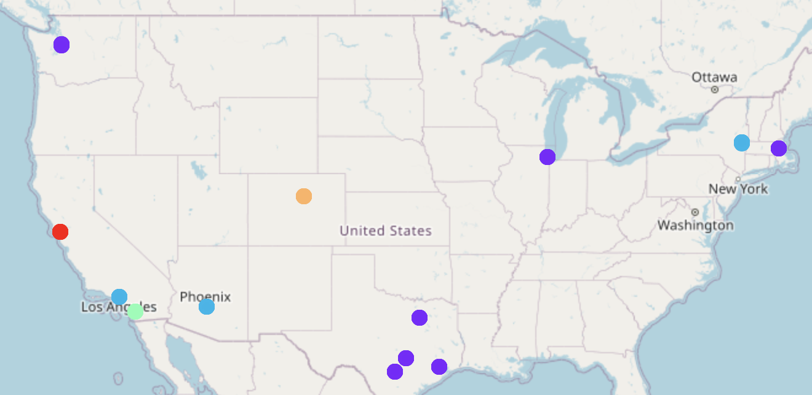

# Foursquare-based City Clustering

This project was at first developed as part of the IBM Data Science Professional Certificate Capstone Project. It was further developed into a single utility function which provides an easy way for a user to compare three or more cities using KMeans clustering with data provided by Foursquare. This repository contains several examples and tutorials. In the main example, major tech hub cities including San Francisco, Chicago, and Boston are compared based on the most popular venues. Below you will find more information on the usage of the `foursquare_utils.py` utility function.

For this proof-of-concept unsupervised challenge, a simple k-Means clustering model was selected. Future work includes using other great algorithms like DBSCAN and OPTICS. The location of the cities is not a feature in the dataset and must not be. Including this will simply make recommendations based on physical distance. What we want is recommendations based on environmental and social factors. Due to the limitations of the Foursquare API free tier, only the twenty most popular venues were extracted. In an ideal scenario, the dataset would be bigger and user preferences could be extracted. 

## Usage

The `get_analysis_per_city()` is the main utility function. Below is a snippet of the function's documentation. 

```python
def get_analysis_per_city(city_state_list, num_venues=20, radius=1000, clusters=3, saving_dir=None):
    """
    Given a list of cities:

        1. The coordinates are obtained using `geopy`
        2. These coordinates are then used to obtain the top recommended venues and the respective ratings using `Foursquare`.
            -  Beware that appending the ratings means using premium calls. 
        3. The obtained data is formatted and a `KMeans` model is fitted using `k` user-defined clusters. Similar cities are grouped together.

    Notice that the num_venues argument will specify the number of regular and premium calls for each city.

    Args:
        city_state_list (list): a list containing "city, state" strings for analysis.
        num_venues (int, optional): The number of recommended venues to get. Defaults to 20.
        radius (int, optional): The radius in meters for which to get recommended venues. Defaults to 1000.
        clusters (int, optional): The number of clusters to fit. Must be at most the number of cities queried. Defaults to 3.
        saving_dir (str, optional): name of the directory to be created where the results will be stored. Defaults to None.

    Returns:
        None
    """    
```

Let's say we want to compare and get the similarity among a number of cities:

```python
cities_list = ["San Francisco, California", 
               "Denver, Colorado", 
               "Seattle, Washington", 
               "Los Angeles, California", 
               "New York City, NY", 
               "Chicago, Illinois", 
               "Austin, Texas", 
               "Boston, Massachusetts"]
```

You can then use the `get_analysis_per_city()` function using the `foursquare_utils.py` script.

```python
from src import foursquare_utils
results_dir = "Example/"
foursquare_utils.get_analysis_per_city(cities_list, num_venues=10, radius=1000, clusters=3, saving_dir=results_dir)
```

A number of files are created this way enabling the recycling of data else premium calls would be made each time the function is called. The structure of the created directory is the following:

```
Example
│   cities.txt    
│
└───CSV_Files
│   │   cities_venues.csv
│   │   clustering_results.csv
│   │   most_common_venues.csv
│   
└───Folium
│   │   clustering_results_map.html
│
└───KNN_Model
    │   knn.joblib
```


- `cities_venues.csv`: contains the results from the Foursquare API calls including the venue ratings (premium calls). You can reuse this for your own purposes. 

- `clustering_results.csv`: is the same as the `cities_venues.csv` file except each venue carries a cluster label. This file is created after the KNN model is fitted. 

- `most_common_venues.csv`: contains then ten most common venue categories for each city. 

- `clustering_results_map.html`: contains a `Folium` map with each city color coded for the cluster it belongs to. 



You can see in this case that San Francisco and Boston are found to be the similar. 


## Setup

Other than the usual packages you will need to install `geopy` and `folium`. For a list of all the relevant used packages and versions please refer to the `environment.yml` file. 

To run the notebooks or the functions the Foursquare credentials must be set. You may notice that this is done via a `config.py` file which is not part of the repository since each API key is personal and unique.

Create a `config.py` file in the main directory. The contents should have the following structure (notice that the API version is fixed):

```python
CLIENT_ID = 'your Foursquare ID'
CLIENT_SECRET = 'your Foursquare Secret'
VERSION = '20180604'
```